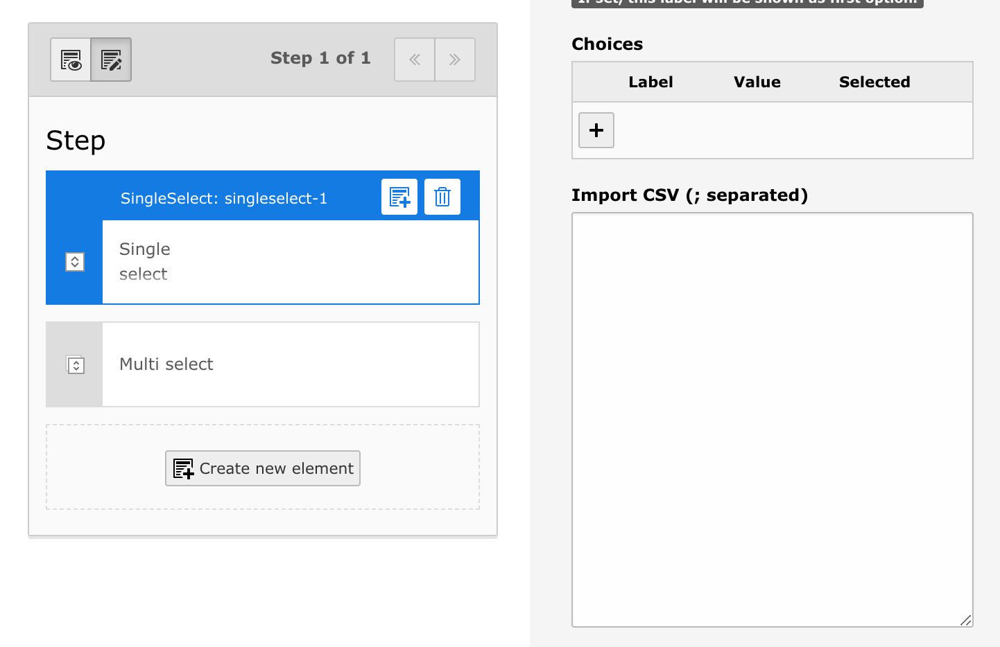
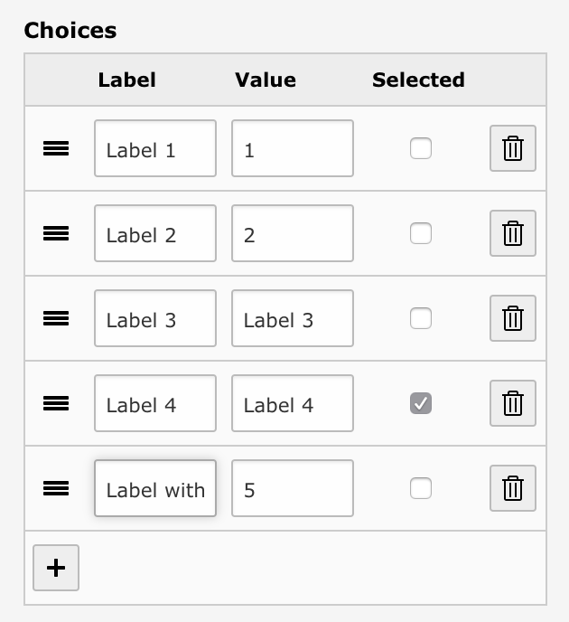

# Import CSV data for form select options

## What does it do?

The extension adds a new field to the following elements:

* Single select
* Multi select
* Multi checkbox
* Radio button

(all elements where there's a _Choices_ field)

You can insert CSV data (see below for possible format and options) in this field. If you save the element, the CSV data is imported as _Choices_ rows.

 (see below for the given data for this result)

## Installation

Require via composer 

    composer require "plan2net/form-options-csv"

and activate the extension through the Extension manager.

## Possible values in the import field

    1: Label 1;1;1
    2: Label 2;2
    3: Label 3
    4: Label 4;;1
    5: "Label with ; works too";5;1
    
1. Label is set to 'Label 1', value is set to '1' and the option is selected as default
2. Label is set to 'Label 2', value is set to '2'
3. Label _and_ value are set to 'Label 3'
4. Label _and_ value are set to 'Label 4' and the option is set as default
5. Escape the label with `""` (CSV standard) and you can use `;` in the text too

The import field is cleared after the form element is saved.

For single select values only the first entry with a selected option is set and ignored for all other entries.

## Known issues

* Doesn't work within fieldset (yet)

